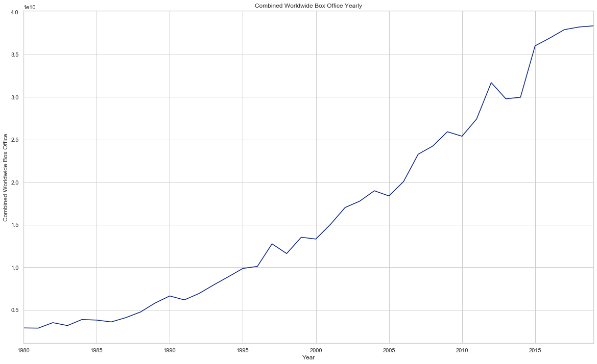
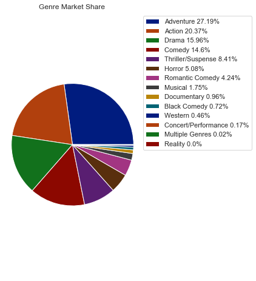
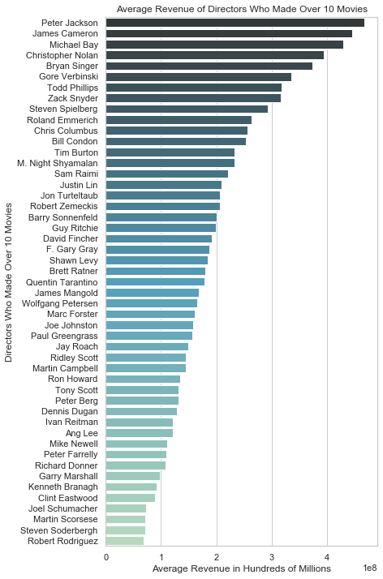
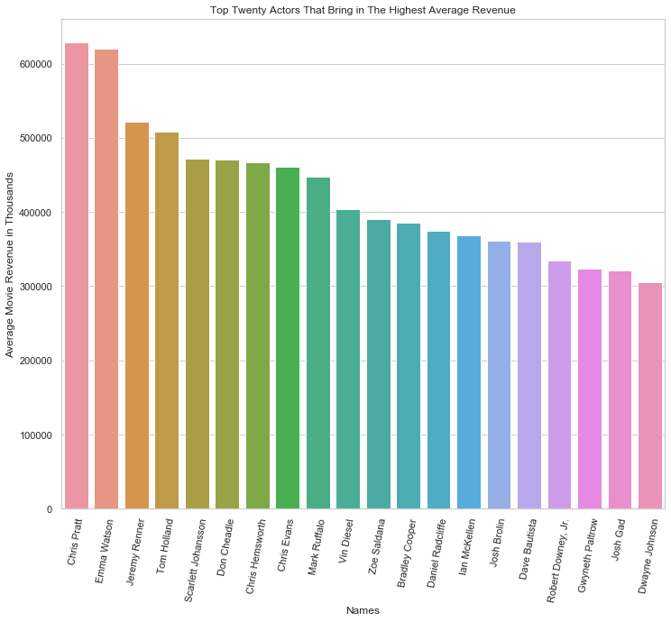
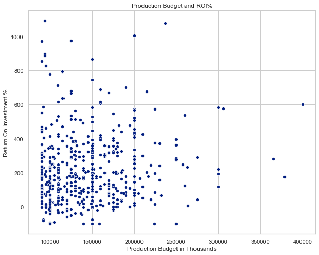
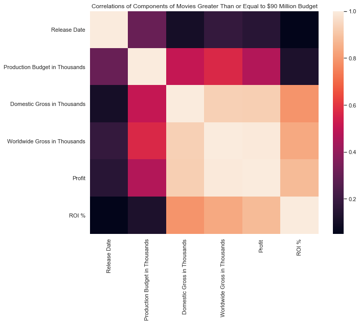
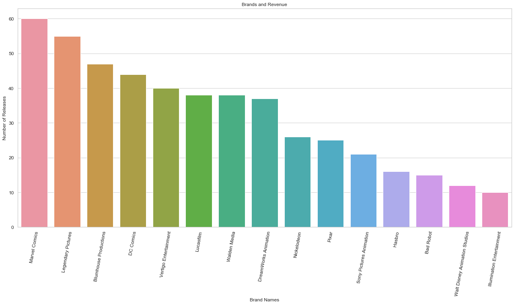

## Film Industry Analysis Project

Flatiron Module 1 Media Project Avidan Berman & J Daniel Kim

### Project Overview

Microsoft sees all the big companies creating original video content, and they want to get in on the fun. They have decided to create a new movie studio, but the problem is they don’t know anything about creating movies. Our team has been hired to gather and analyze movie data to provide Microsoft with insight and recommendations that give them an edge over the competition. 

The area’s in which our team looked to address are:
- Is it a good time to enter the market?
- What genres have a greater control of the market?
- Which experienced actors bring in the most money per movie?
- Which experienced directors bring in the most money per movie?
- What is the relationship between production budget and return on investment?
- Who are the competing brands?


### The Approach

- Review provided data
- Review available data from expert websites IMDB, TMDB, Box Office Mojo and The-Numbers
- Web scraped data from Box Office Mojo and The-Numbers using Beautiful Soup and Jupyter Notebooks
- Cleaned and analyzed scraped data using the Pandas Library
- Visualized our data using the MatPlotlib and Seaborn Libraries


### Review Provided Data

After careful review of the provided data, we felt that the data did not allow for the level of analysis required for our team to serve our client with recommendations whether to  enter the movie industry. There were many gaps while merging the files and inaccurate information.

### Review and Gathering of Data

After reviewing the available film data online, we determined that the data provided by The-Numbers and Box Office Mojo provided the greatest insight into the movie industry. The-Numbers had many different charts that would allow for analysis from many different points of view. Box Office Mojo allowed for us to fill in the few holes left behind by The-Numbers. Our team used Jupyter Notebooks to organize our work and the BeautifulSoup library to web scrape the data from webpages identified by our team. We ultimately decided not to use data that we collected from IMDB due to a lack of clarity. Much of the data on movies, actors and directors were given with the use of aliases. Due to a lack of guide for the aliases, decoding IMDB was considered cumbersome when there was strong data available elsewhere.

### Cleaning Data

In order to run analysis on the data gathered, our team needed to clean and merge the data. Much of the data was broken into segments, our team took much of our time merging the related data together and removing data that wasn’t complete. Much of the data needed to be reformatted in order for analysis to run smoothly. Once cleaned, our team ran multiple pandas analysis methods to help provide insight. Afterwards, we have created visualizations to best answer the questions.

### Visualizations


```python
from IPython.display import Image
```

Is it a good time to enter the market?
We used a line graph to visually represent the trend of Worldwide Box Office Yearly. Based on this graph, we believe that the annual growth of Worldwide Box Offices indicates that it is a good time to enter the market. 


```python
Image(filename= "Combined Worldwide Box Office Yearly.png")
```





What genres have a greater control of the market?
We used a pie chart to show what percentage of box-office revenue was brought in by each genre. Based on this graph Adventure, Action, Drama, and Comedy make up the majority of the market. 


```python
Image(filename= "Genre Market Share.png")
```





Which experienced directors bring in the most money per movie?
We used a barchart because directors are categorical and the y axis can represent corresponding numerical values. For this data we have specifically chosen directors that made over 10 movies to establish a consistent movie making track, then we found the average revenue per movies made. The top directors to get are Peter Jackson, James Cameron, Michael Bay,
Chistoper Nolan, and Bryan Singer. 


```python
Image(filename= "Average Revenue of Directors Who Made Over 10 Movies.png")
```





Which experienced actors bring in the most money per movie?
We used a barchart because actors are categorical and the y-axis can represent corresponding numerical values. The top actors that bring in the most revenue per movie is Chris Pratt, Emma Watson, and Jeremy Rener. 


```python
Image(filename= "Top Twenty Actors That Bring in The Highest Average Revenue.png")
```





What is the relationship between production budget and return on investment?
We selected movies that had over a 90 million dollar budget. We think Microsoft should produce a movie around that budget. We used a scatter to show that the relationship between production budget and ROI% (return on investment) are not correlated.


```python
Image(filename= "Production Budget and ROI%.png")
```





We used a correlation table heatmap because we want to show the relationship between different financial components that make a successful movie with budgets at least 90 million. The chart also helps further demonstrate that the correlation between production budget and ROI% is near zero. 


```python
Image(filename= "Correlations of Components of Movies Greater Than or Equal to $90 Million Budget.png")
```





Who are the competing brands? We used a barchart because competiters are categorical and the y axis can represent coresponding numerical values of the amount of movies made. The top brands to compete with are Marvel Comics, Legendary Pictures, Blumhouse Productions, DC Comics and Vertigo Entertainment. We believe that Microsoft should build a brand that capitalizes around a genre. For instance, Marvel Comics on Action and superheros 


```python
Image(filename= "Brands and Revenue.png")
```





### Recommendations

- Due to the general uptrend in the annual worldwide box office revenue, we believe that once COVID-19 ends it will be a good decision to enter the market.

- The top producing genres are adventure and action movies but we suggest also investing in Horror, Thriller/Suspense and Musicals as they are all top producers with much less competition

- We have specifically selected directors with over ten movies and averaged how much they make per movie to help standardize a consistency. We believe that the top 5 directors to hire according to this metric is Peter Jackson, James Cameron, Michael Bay, Christopher Nolan, and Bryan Singer

- We have averaged the amount of revenue an actor brings in per movie. According to our data, we believe the top ten actors are : Chris Pratt, Emma Watson, Jeremy Renner, Tom Holland, Scarlett Johansson, Don Cheadle, Chris Hemsworth, Chris Evans, Mark Ruffalo, and Vin Diesel.

- We have shown the scatter plot to show the general spread of the data between the production budget and return on investments. On the heatmap, while there is a positive correlation between production budget and return on investment, there doesn’t seem to be a strong dependence between the two.

- The top competing brands are Disney(owns Marvel Comics, Lucasfilm, Pixar, Walt Disney Animation Studios and Touchstone (Not Listed)), Legendary Pictures, DC Comics and Blumhouse Productions.

